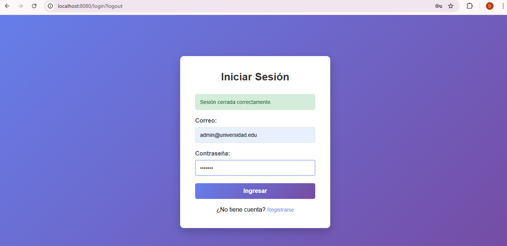
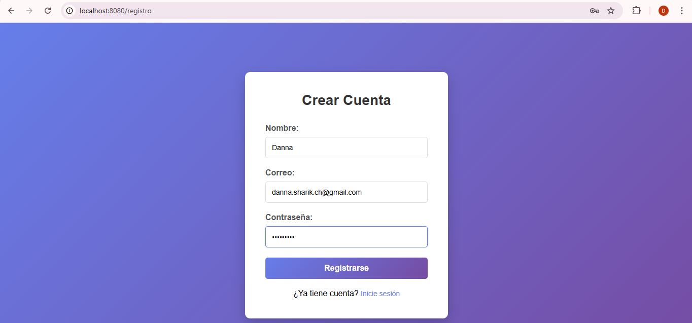
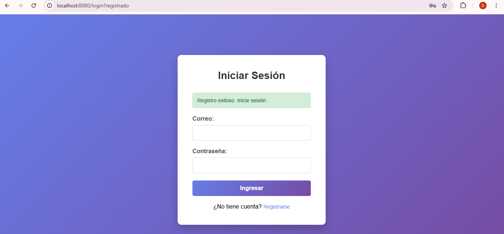
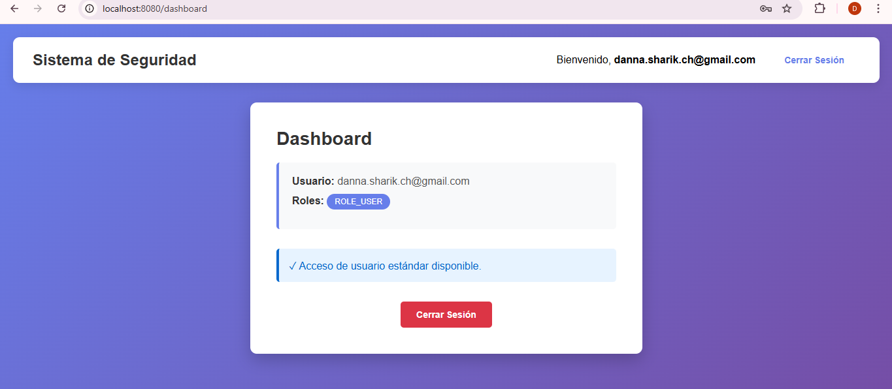
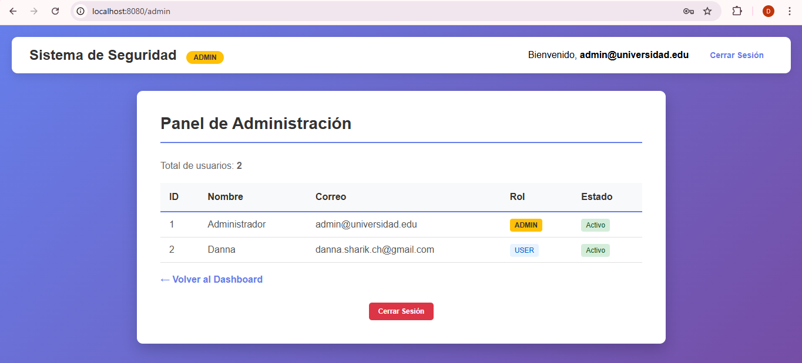
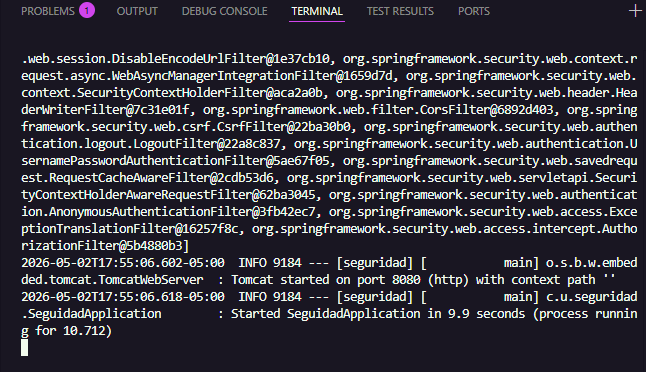

# Sistema de Autenticación con Spring Security 6

## Descripción

Sistema de autenticación y autorización basado en roles con Spring Security 6, MySQL, JPA y Thymeleaf. Incluye registro de usuarios con encriptación BCrypt, login validado y acceso diferenciado por roles (ADMIN/USER).

---

## 🚀 Cómo Ejecutar

### 1. Configurar Base de Datos MySQL

```sql
CREATE DATABASE IF NOT EXISTS estudiantes_db;
USE estudiantes_db;

CREATE TABLE usuarios (
    id BIGINT AUTO_INCREMENT PRIMARY KEY,
    nombre VARCHAR(100) NOT NULL,
    email VARCHAR(150) NOT NULL UNIQUE,
    contrasenia VARCHAR(255) NOT NULL,
    rol VARCHAR(20) NOT NULL,
    activo BOOLEAN DEFAULT TRUE
);

CREATE USER IF NOT EXISTS 'appuser'@'localhost' IDENTIFIED BY 'password';
GRANT ALL PRIVILEGES ON estudiantes_db.* TO 'appuser'@'localhost';
FLUSH PRIVILEGES;

INSERT INTO usuarios (nombre, email, contrasenia, rol, activo) VALUES 
('Admin', 'admin@universidad.edu', '$2a$12$X10WMk9nk1.kYzGOScs0yuK1NXSjOIeiLqMXqBRJ6y5o2U10qss5a', 'ROLE_ADMIN', 1);
```

### 2. Ejecutar la Aplicación

```bash
cd c:\Users\DANNA\Documents\Visual Studio Code\Cardenas-post1-u9
mvn clean install
mvn spring-boot:run
```

Acceso: **http://localhost:8080**

### 3. Credenciales de Prueba

- **Email:** admin@universidad.edu
- **Contraseña:** admin123
- **Rol:** ROLE_ADMIN

---

## 📸 Capturas de Entrega

### Punto 1: Formulario de Login


### Punto 2: Formulario de Registro


### Punto 3: Registro Exitoso


### Punto 4: Dashboard del Usuario


### Punto 5: Panel de Administrador


### Punto 6: Terminal con Startup

# Sistema de Autenticación con Spring Security 6

## Descripción

Sistema de autenticación y autorización basado en roles con Spring Security 6, MySQL, JPA y Thymeleaf. Incluye registro de usuarios con encriptación BCrypt, login validado y acceso diferenciado por roles (ADMIN/USER).

```

### Ejecutar la Aplicación

```bash
cd c:\Users\DANNA\Documents\Visual Studio Code\Cardenas-post1-u9
mvn clean install
mvn spring-boot:run
```

Acceso: **http://localhost:8080**

### Credenciales de Prueba

- **Email:** admin@universidad.edu
- **Contraseña:** admin123
- **Rol:** ROLE_ADMIN

---

## Capturas de Entrega

### Punto 1: Formulario de Login


### Punto 2: Formulario de Registro


### Punto 3: Registro Exitoso


### Punto 4: Dashboard del Usuario


### Punto 5: Panel de Administrador


### Punto 6: Terminal con Startup


